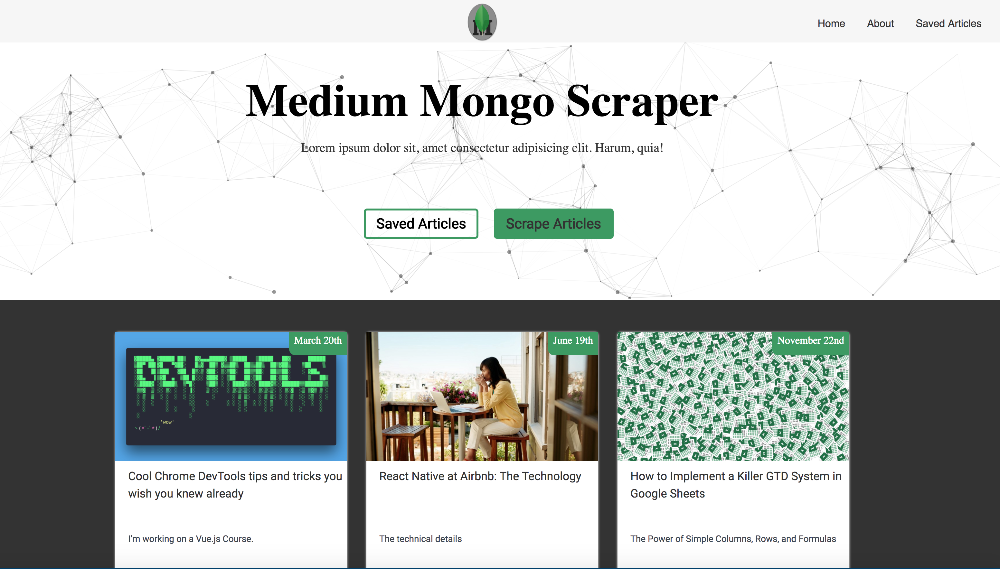
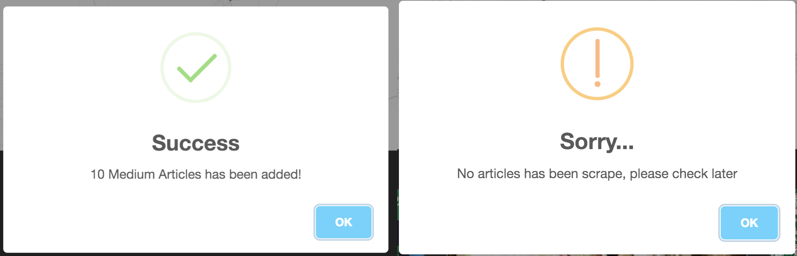
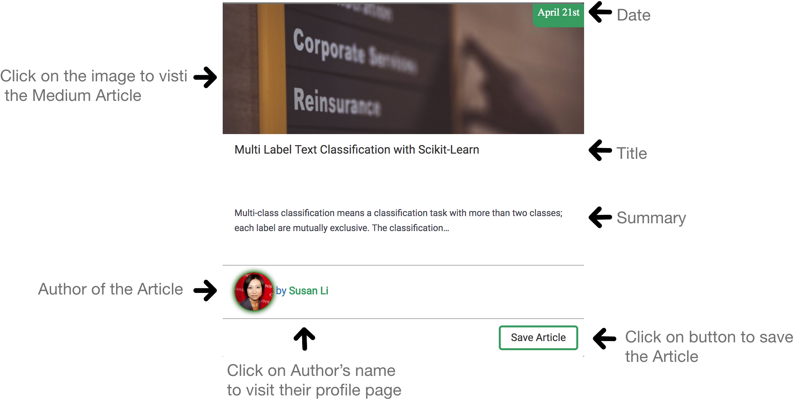
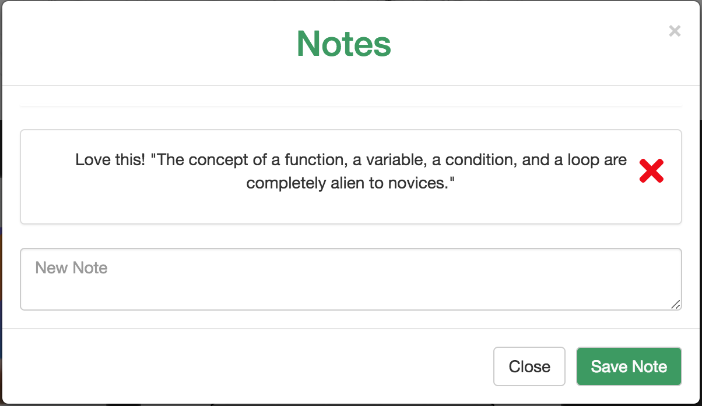

# Medium Mongo Scraper 

Medium Mongo Scraper is an application that web-scrapes articles data from [Medium](medium.com) allowing the user to save articles and comment about what they have read.

Please check out the launched app on Heroku [Here](https://majestic-bryce-canyon-84060.herokuapp.com/)!

### Main Page 

## Instructions
* Click on "Scrape Articles" button to add more articles to the website. If, there is no new articles, you will receive the warning below.
* Click on "Saved Articles" button to check all the articles that has been saved.

### Scrape Container 

## Notes

## Demo

## Technical Details

### Npm Packages:
* [Body Parser](https://www.npmjs.com/package/body-parser)
* [Cheerio](https://www.npmjs.com/package/cheerio)
* [Request](https://www.npmjs.com/package/request)
* [Express](https://www.npmjs.com/package/express)
* [Gulp](https://www.npmjs.com/package/gulp)
* [Gulp Sass](https://www.npmjs.com/package/gulp-sass)
* [Gulp Sourcemaps](https://www.npmjs.com/package/gulp-sourcemaps)
* [Mongoose](https://www.npmjs.com/package/mongoose)
* [Morgan](https://www.npmjs.com/package/morgan)

#### Built With 

* Visual Studio Code
* Bootstrap 3.3.7 
* [Sweet Alert](https://sweetalert.js.org/guides/)
* [Toastr](https://github.com/CodeSeven/toastr)
* **And this awesome library [ParticlesJS](https://vincentgarreau.com/particles.js/)

